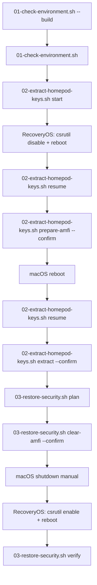

# Operational procedure

Orchestrated workflow for HomeKit keychain extraction on Apple Silicon macOS.

## Overview



Functional reference: [docs/SOURCE_PINS.md](SOURCE_PINS.md)

## Prerequisites

- Xcode installed: `sudo xcode-select --switch /Applications/Xcode.app/Contents/Developer`
- Apple Development certificate in Keychain Access
- Intermediate CA certificates if needed (Apple WWDRCA, Apple WWDRCAG3)
- Project validated: `./scripts/01-check-environment.sh --build`
- Apple Silicon (arm64); orchestration scripts look for the arm64 Swift build path

## Phase 1 — Environment check

```bash
./scripts/01-check-environment.sh
./scripts/01-check-environment.sh --build
./scripts/01-check-environment.sh --report
```

`01-check-environment.sh` is read-only. It is the only script that may run `swift build` (with `--build`).

## Phase 2 — Extraction workflow

```bash
./scripts/02-extract-homepod-keys.sh start --confirm
# RecoveryOS manual: csrutil disable, reboot
./scripts/02-extract-homepod-keys.sh resume   # AMFI boot-arg + reboot prompt
# reboot macOS
./scripts/02-extract-homepod-keys.sh resume   # extract + AMFI cleanup
# RecoveryOS manual: csrutil enable, reboot
./scripts/02-extract-homepod-keys.sh resume   # verify restored
```

CodeSignKit uses the default `Apple Development` identity when `CODESIGNKIT_DEFAULT_IDENTITY` is unset.
Security confirmation is collected once at `start --confirm`; `resume` orchestrates macOS steps.

Extraction runs the pre-built binary directly (no `swift run`, no implicit rebuild):

```bash
.build/arm64-apple-macosx/debug/HomePodKeychainExtractor extract -g "com.apple.hap.pairing"
```

Output is written to `.run/dump/dump.txt`. Workflow state and logs never contain secrets.

## Phase 3 — Restore security

```bash
./scripts/03-restore-security.sh status
./scripts/03-restore-security.sh plan
./scripts/03-restore-security.sh clear-amfi --confirm
# manual: sudo shutdown -h now
# RecoveryOS manual: csrutil enable, then reboot
./scripts/03-restore-security.sh verify
./scripts/03-restore-security.sh finalize
```

`03-restore-security.sh` never runs `csrutil enable` from macOS. RecoveryOS steps remain manual.

## Manual RecoveryOS steps (historical reference)

### Disable system protections

1. Boot into RecoveryOS (hold power button until Startup Options appear).
2. Terminal → `csrutil disable` → `reboot`
3. Back in macOS: `sudo nvram boot-args="amfi_get_out_of_my_way=0x1"` → `sudo reboot`

The orchestration scripts guide these steps but do not execute RecoveryOS commands.

### Restore system protections

1. macOS: `sudo nvram boot-args=""` → `sudo shutdown -h now`
2. RecoveryOS: connect to a network with Internet access, then `csrutil enable` → `reboot`

## Success / failure criteria

Extraction succeeds only when:

- the extractor exits with code 0
- `dump/dump.txt` exists and is non-empty
- parsed output contains `Keychain Items Matched: N` with `N > 0` (ANSI stripped for validation only)

Any other outcome is `extract_failed`. Partial dumps are preserved.

## Probe (existence check, no secrets)

```bash
swift run HomePodKeychainExtractor probe
```

With AMFI enabled, the probe may be blocked by restricted entitlements — this is expected.

## Annex — raw extraction command

For reference only (orchestrated workflow preferred):

```bash
export CODESIGNKIT_DEFAULT_IDENTITY="Apple Development: appleid@example.com (TEAMID)"
mkdir -p dump
.build/arm64-apple-macosx/debug/HomePodKeychainExtractor extract -g "com.apple.hap.pairing" 1> dump/dump.txt 2>&1
```

After a successful dump, build a local `pairing.json` (never commit it).
You can run the collector, a `homekit[IP]` script, or another HAP client.
See the repository root `README.md` and `collector/README.md`.
